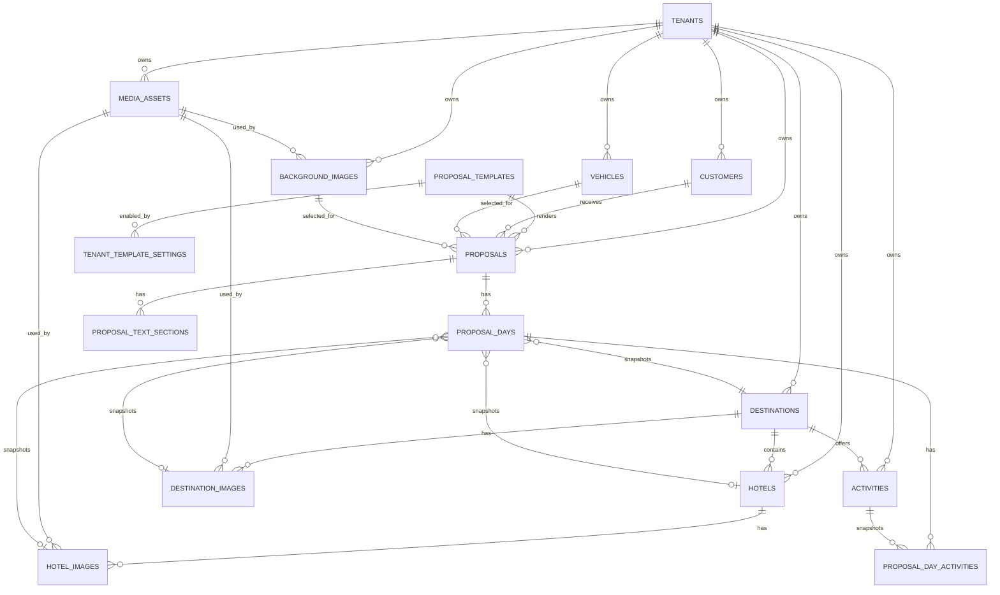

# Travel Ideate Architecture Proposal

Version: `v0.2.0`

This document describes the target architecture for turning Travel Ideate from
a local JSON-backed proposal builder into a multi-tenant SaaS product.

## Product Surfaces

Travel Ideate should have two major surfaces:

- Proposal workspace: customer proposals, day builder, preview, PDF export.
- Admin panel: tenant-owned master data and media management.

The proposal workspace consumes curated data. The admin panel owns the data.

## Tenant Model

Use `tenants` as the top-level business boundary. A tenant is one travel
company using the product.

Every private business table should include `tenant_id`:

- media assets
- destinations
- destination images
- hotels
- hotel images
- background images
- vehicles
- activities
- proposal template settings

This lets multiple travel companies share one physical database without seeing
each other's records.

Tenant-owned child records should reference tenant-owned parents through
composite keys where possible:

```text
foreign key (tenant_id, hotel_id) references hotels(tenant_id, id)
```

This prevents accidental cross-tenant joins such as a hotel image from tenant A
selecting a media asset that belongs to tenant B.

Before production launch, PostgreSQL row-level security should be enabled for
tenant-owned tables. The application should set the tenant on each request:

```sql
set local app.tenant_id = '<tenant uuid>';
```

Policies can then restrict every tenant-owned table with:

```sql
tenant_id = current_setting('app.tenant_id')::uuid
```

## Admin Panel Scope

The admin panel should manage:

- Destinations: name, region, summary, active state, destination images.
- Hotels: destination mapping, name, category, room type, meal plan, images.
- Background images: cover images used by proposals.
- Vehicles: name, capacity, default notes.
- Activities: reusable activity names, optionally destination-specific.
- Templates: enable or disable system templates per tenant.
- Media assets: uploaded files and reusable image metadata.

Deletes should be soft deletes through `is_active` and `archived_at`. Hard
deletes should be reserved for records that were never used.

## Proposal Generation

Proposals are generated on the fly. The frontend keeps the editable proposal in
browser memory and sends the full proposal payload to preview/PDF endpoints.
There are no saved proposal records, proposal list pages, or duplicate flows.

## Image Model

Use one generic `media_assets` table for uploaded files:

```text
media_assets
  tenant_id
  content
  file_name
  mime_type
  file_size
  width
  height
  aspect_ratio
  focal_point
```

Specialized image tables attach media assets to business entities:

- `destination_images`
- `hotel_images`
- `background_images`

These tables keep labels, sort order, active state, and role-specific defaults.
Runtime image URLs are generated by the API as `/api/media/{media_asset_id}`;
the URL is not stored as inventory data.

Recommended image roles:

- Background/cover: `16:9`, minimum `1920x1080`.
- Destination: `4:3`, minimum `1600x1200`.
- Hotel: `4:3`, minimum `1600x1200`.

Templates should still be resilient through CSS `aspect-ratio`, `object-fit`,
and image `focal_point`.

Meal plans are shared application enums, not hotel properties. Proposals select
values such as `EP`, `CP`, `MAP`, and `AP` per itinerary/day.

## Backend Modules

Target structure:

```text
backend/app/
  db/
    session.py
    models.py
    migrations/

  routers/
    admin_destinations.py
    admin_hotels.py
    admin_media.py
    admin_vehicles.py
    admin_activities.py
    proposals.py
    templates.py

  services/
    inventory.py
    media.py
    renderer.py
    pdf.py

  schemas/
    inventory.py
    media.py
    proposals.py
```

Keep routers thin. Put tenant-aware business rules in services.

## API Direction

Admin APIs:

```text
GET    /api/admin/destinations
POST   /api/admin/destinations
PATCH  /api/admin/destinations/:id
DELETE /api/admin/destinations/:id

POST   /api/admin/destinations/:id/images
PATCH  /api/admin/destination-images/:id

GET    /api/admin/hotels
POST   /api/admin/hotels
PATCH  /api/admin/hotels/:id
DELETE /api/admin/hotels/:id

POST   /api/admin/hotels/:id/images

GET    /api/admin/background-images
POST   /api/admin/background-images

GET    /api/admin/vehicles
POST   /api/admin/vehicles
PATCH  /api/admin/vehicles/:id
DELETE /api/admin/vehicles/:id

GET    /api/admin/activities
POST   /api/admin/activities
PATCH  /api/admin/activities/:id
```

Proposal APIs:

```text
POST   /api/proposals/render
POST   /api/proposals/pdf
```

## Frontend Routes

Target route structure:

```text
frontend/app/
  page.js

  admin/
    layout.js
    destinations/page.js
    hotels/page.js
    vehicles/page.js
    activities/page.js
    backgrounds/page.js
    templates/page.js
```

Shared components:

```text
frontend/components/admin/
  DataTable.js
  EntityForm.js
  ImageManager.js
  FocalPointPicker.js

frontend/components/proposals/
  ProposalEditor.js
  DayEditor.js
  PreviewPane.js
```

## Implementation Phases

1. Add PostgreSQL, SQLAlchemy, Alembic, and tenant-aware models.
2. Seed database from current JSON data.
3. Replace inventory JSON reads with database-backed services.
4. Build admin panel for destinations, hotels, images, vehicles, activities.
5. Add auth, tenant membership, and PostgreSQL row-level security policies.

Current implementation status:

- `backend/db/schema.sql` validates against PostgreSQL 17.
- `scripts/seed_database.py` seeds tenant inventory from current JSON fixtures.
- `/api/inventory` reads from PostgreSQL when `DATABASE_URL` is configured.
- `/api/proposals/sample` reads a starter proposal JSON used to bootstrap a new
  in-memory proposal.

## ER Diagram


